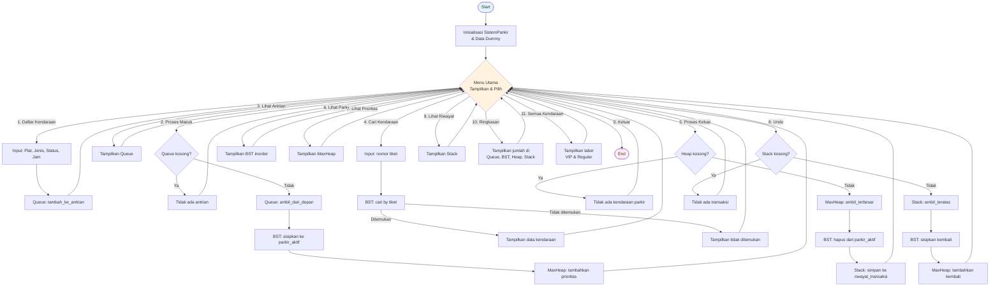

# Sistem Manajemen Parkir — Algoritma & Struktur Data

Program ini adalah simulasi sistem manajemen parkir yang mengimplementasikan empat struktur data fundamental: **Queue**, **Stack**, **Binary Search Tree (BST)**, dan **Max Heap**. Setiap kendaraan yang masuk diproses melalui antrian, disimpan di area parkir, diprioritaskan saat keluar, dan riwayat transaksinya dicatat. Program ditulis dengan prinsip **clean code** agar mudah dipahami.

---

## Struktur Data yang Digunakan

### 1. `Node`
Kelas dasar untuk linked list yang dipakai oleh `Queue` dan `Stack`.

| Atribut | Deskripsi |
|---------|-----------|
| `data`  | Nilai/muatan yang disimpan di dalam node |
| `next`  | Penunjuk ke node berikutnya (`None` = node terakhir) |

---

### 2. `Queue` — Antrian (FIFO: First In, First Out)
Menggunakan linked list dengan pointer `front` (depan) dan `rear` (belakang).
Kendaraan yang **pertama masuk** akan **pertama diproses**.

| Method                | Deskripsi |
|-----------------------|-----------|
| `tambah_ke_antrian`   | Tambah kendaraan ke belakang antrian |
| `ambil_dari_depan`    | Ambil & hapus kendaraan paling depan |
| `lihat_depan`         | Lihat kendaraan paling depan tanpa menghapus |
| `tampilkan_semua`     | Kembalikan list seluruh isi antrian |
| `kosong`              | Cek apakah antrian kosong |
| `hitung_isi`          | Hitung jumlah kendaraan dalam antrian |

**Digunakan untuk**: antrian kendaraan yang baru datang dan menunggu masuk area parkir.

---

### 3. `Stack` — Tumpukan (LIFO: Last In, First Out)
Menggunakan linked list dengan pointer `puncak`.
Data yang **terakhir dimasukkan** akan **pertama diambil**.

| Method         | Deskripsi |
|----------------|-----------|
| `simpan`       | Simpan data baru ke puncak tumpukan |
| `ambil_teratas`| Ambil & hapus data dari puncak tumpukan |
| `lihat_teratas`| Lihat data puncak tanpa menghapus |
| `tampilkan_semua` | Kembalikan list seluruh isi tumpukan |
| `kosong`       | Cek apakah tumpukan kosong |
| `hitung_isi`   | Hitung jumlah elemen dalam tumpukan |

**Digunakan untuk**: menyimpan riwayat transaksi keluar, sehingga bisa di-*undo*.

---

### 4. `BinarySearchTree` (BST)
Pohon pencarian biner yang menyimpan kendaraan dengan key unik (nomor tiket).
Setiap node (`BSTNode`) memiliki atribut: `key`, `data`, `left`, `right`.

```
Contoh BST dengan tiket [5, 3, 7, 1, 4]:
      5
     / \
    3   7
   / \
  1   4
```

| Method                  | Deskripsi |
|-------------------------|-----------|
| `sisipkan`              | Tambah node baru (rekursif) |
| `cari`                  | Cari node berdasarkan key (nomor tiket) |
| `hapus`                 | Hapus node (3 kasus: tanpa anak, satu anak, dua anak) |
| `_cari_node_terkecil`   | Cari node dengan key terkecil (inorder successor) |
| `tampilkan_inorder`     | Traversal kiri→akar→kanan, hasil terurut menaik |
| `kosong`                | Cek apakah pohon kosong |
| `hitung_tinggi`         | Hitung tinggi pohon secara rekursif |
| `hitung_node`           | Hitung total jumlah node secara rekursif |

**Digunakan untuk**: menyimpan kendaraan yang sedang parkir, dengan key = nomor tiket.

---

### 5. `MaxHeap`
Implementasi heap dengan Python list. Elemen dengan **prioritas tertinggi** selalu berada di posisi pertama (index 0). Setiap elemen berupa tuple `(prioritas, no_tiket)`.

| Method          | Deskripsi |
|-----------------|-----------|
| `tambahkan`     | Tambah elemen lalu jalankan `_naikkan` |
| `ambil_terbesar`| Ambil elemen prioritas tertinggi lalu jalankan `_turunkan` |
| `lihat_terbesar`| Lihat elemen tertinggi tanpa menghapus |
| `_naikkan`      | Proses internal: naikkan elemen sampai heap valid |
| `_turunkan`     | Proses internal: turunkan elemen sampai heap valid |
| `tampilkan_semua` | Kembalikan salinan list heap |
| `kosong`        | Cek apakah heap kosong |
| `hitung_isi`    | Hitung jumlah elemen di heap |

**Digunakan untuk**: menentukan urutan prioritas keluar — kendaraan dengan skor tertinggi keluar lebih dulu.

---

### 6. Kelas `Kendaraan`
Merepresentasikan satu kendaraan dalam sistem parkir.

| Atribut     | Deskripsi |
|-------------|-----------|
| `no_tiket`  | Nomor tiket unik (otomatis dari counter) |
| `plat`      | Plat nomor kendaraan |
| `jenis`     | `"Mobil"` atau `"Motor"` |
| `status`    | `"VIP"` atau `"Reguler"` |
| `jam_masuk` | Jam kedatangan (0–23) |
| `prioritas` | Skor prioritas (dihitung otomatis) |

**Rumus prioritas:**
```
prioritas = skor_status + skor_jenis + (jam_masuk × 10)

skor_status : VIP = 120, Reguler = 20
skor_jenis  : Mobil = 50, Motor = 25
```

> Semua angka skor disimpan sebagai **konstanta bernama** (`SKOR_STATUS_VIP`, `SKOR_JENIS_MOBIL`, dst.) agar mudah diubah.

---

### 7. Kelas `SistemParkir` — Integrasi Semua Struktur

| Method                       | Alur Data |
|------------------------------|-----------|
| `daftarkan_kendaraan`        | Input → **Queue** |
| `proses_kendaraan_masuk`     | **Queue** → ambil dari depan → **BST** + **Heap** |
| `cari_kendaraan`             | Cari di **BST** berdasarkan nomor tiket |
| `proses_kendaraan_keluar`    | **Heap** (ambil terbesar) → **BST** (hapus) → **Stack** (simpan) |
| `batalkan_transaksi_terakhir`| **Stack** (ambil teratas) → **BST** (sisipkan) + **Heap** (tambahkan) |
| `tampilkan_antrian_masuk`    | Tampilkan isi **Queue** |
| `tampilkan_parkir_aktif`     | Tampilkan isi **BST** (inorder, urut tiket) |
| `tampilkan_urutan_prioritas` | Tampilkan isi **Heap** (urut prioritas tertinggi) |
| `tampilkan_riwayat_transaksi`| Tampilkan isi **Stack** (terbaru ke terlama) |
| `tampilkan_ringkasan_sistem` | Tampilkan jumlah kendaraan di tiap struktur |
| `tampilkan_semua_kendaraan`  | Tampilkan **semua kendaraan** dalam tabel, dikelompokkan VIP & Reguler |

---

## Menu Program

Menu utama ditampilkan dalam **format tabel satu kolom**:

```
+----------------------------------------------------------------------------+
|                          SISTEM MANAJEMEN PARKIR                           |
|                  Algoritma & Struktur Data - Menu Utama                    |
+----------------------------------------------------------------------------+
|  No   | Aksi                                                               |
+----------------------------------------------------------------------------+
|  1.   | Kendaraan Masuk (-> Queue)                                         |
|  2.   | Proses Antrian (Queue -> BST -> Heap)                              |
|  3.   | Lihat Antrian Masuk (Queue)                                        |
|  4.   | Cari Kendaraan (BST)                                               |
|  5.   | Proses Keluar (Heap -> BST -> Stack)                               |
|  6.   | Lihat Status Parkir (BST)                                          |
|  7.   | Lihat Prioritas Keluar (Heap)                                      |
|  8.   | Undo Transaksi Terakhir (Stack -> BST -> Heap)                     |
|  9.   | Lihat Riwayat Transaksi (Stack)                                    |
|  10.  | Ringkasan Semua Struktur Data                                      |
+----------------------------------------------------------------------------+
|  11.  | Lihat Semua Kendaraan (Tabel VIP & Reguler)                        |
|  0.   | Keluar                                                             |
+----------------------------------------------------------------------------+
```

| No  | Fungsi |
|-----|--------|
| 1   | Daftarkan kendaraan baru ke antrian masuk |
| 2   | Proses satu kendaraan dari antrian ke area parkir |
| 3   | Lihat antrian masuk (Queue) |
| 4   | Cari kendaraan berdasarkan nomor tiket (BST) |
| 5   | Proses kendaraan prioritas tertinggi keluar |
| 6   | Lihat kendaraan yang sedang parkir (BST inorder) |
| 7   | Lihat urutan prioritas keluar (MaxHeap) |
| 8   | Batalkan transaksi keluar terakhir (Undo via Stack) |
| 9   | Lihat riwayat transaksi keluar (Stack) |
| 10  | Ringkasan jumlah kendaraan di setiap struktur data |
| 11  | **Lihat semua kendaraan dalam tabel, dikelompokkan VIP & Reguler** |
| 0   | Keluar dari program |

---

## Struktur Kode

Semua kode program digabung dalam satu file `main.py`. Urutan definisi kelas:

| Lapisan | Kelas | Peran |
|---------|-------|-------|
| Struktur Data | `Node`, `BSTNode` | Blok dasar linked list & BST |
| Struktur Data | `Queue`, `Stack`, `MaxHeap`, `BinarySearchTree` | Implementasi struktur data |
| Model | `Kendaraan` | Representasi entitas kendaraan |
| Logika | `SistemParkir` | Mengintegrasikan semua struktur data |
| Antarmuka | `Menu` | Tampilan CLI, routing input, & validasi input pengguna |

### 8. Kelas `Menu` — Antarmuka Pengguna & Validasi Input

Selain menampilkan menu dan memproses pilihan, kelas `Menu` juga menyediakan **helper method statis** untuk validasi input agar program tidak mudah crash:

| Method | Deskripsi |
|--------|-----------|
| `_input_angka(prompt, min_val, max_val)` | Minta input angka, validasi tipe dan range (loop sampai benar) |
| `_input_pilihan(prompt, pilihan1, pilihan2)` | Minta input `1`/`2`, kembalikan string pilihan (loop sampai benar) |
| `_input_plat()` | Minta plat nomor, tidak boleh kosong (loop sampai diisi) |

Ketiga method ini menerapkan prinsip **Clean Code**:
- **DRY** — validasi ditulis sekali, dipakai ulang di `_input_kendaraan_baru` dan `_input_cari_kendaraan`
- **Guard Clauses** — validasi di awal, return segera jika valid
- **Meaningful Error Messages** — pesan spesifik seperti *"Nilai minimal 0"*, *"Pilih 1 untuk Mobil atau 2 untuk Motor"*

---


## Flowchart Sistem Parkir

Berikut adalah diagram alur (flowchart) utama sistem parkir:



### Penjelasan Alur Berdasarkan Menu

| No | Operasi | Alur Struktur Data |
|----|---------|--------------------|
| 1 | Daftarkan kendaraan baru | Input → **Queue** (enqueue) |
| 2 | Proses kendaraan masuk | **Queue** (dequeue) → **BST** (sisip) + **MaxHeap** (tambah) |
| 3 | Lihat antrian masuk | Tampilkan isi **Queue** |
| 4 | Cari kendaraan | **BST** (cari by tiket) |
| 5 | Proses kendaraan keluar | **MaxHeap** (ambil terbesar) → **BST** (hapus) → **Stack** (simpan) |
| 6 | Lihat parkir aktif | Tampilkan **BST** (inorder) |
| 7 | Lihat prioritas keluar | Tampilkan **MaxHeap** |
| 8 | Undo transaksi terakhir | **Stack** (pop) → **BST** (sisip) + **MaxHeap** (tambah) |
| 9 | Lihat riwayat transaksi | Tampilkan **Stack** |
| 10 | Ringkasan sistem | Tampilkan jumlah di **Queue**, **BST**, **MaxHeap**, **Stack** |
| 11 | Lihat semua kendaraan | Tampilkan tabel dari **Queue** + **BST** + **Stack** |

---

## Menu Program

```bash
python main.py
```

---

## Contoh Simulasi Penggunaan

Saat pertama kali dijalankan, program akan **otomatis mengisi 8 data kendaraan dummy** agar Anda bisa langsung melihat bagaimana sistem bekerja.

Berikut adalah simulasi interaksi melalui terminal:

```text
  [SYSTEM] Menambahkan 8 data dummy kendaraan...
  [QUEUE] Kendaraan B 1111 VIP (Mobil, VIP) masuk antrian. Jam: 08:00
  ...
  [SYSTEM] Memproses beberapa kendaraan masuk dan keluar...
  [QUEUE -> BST + HEAP] Tiket#001 - B 1111 VIP parkir (Prioritas:250).
  ...
  [HEAP -> BST -> STACK] Tiket#005 - D 5555 VIP keluar (prioritas:230).
  [SYSTEM] Data dummy selesai disiapkan.

+----------------------------------------------------------------------------+
|                          SISTEM MANAJEMEN PARKIR                           |
|                  Algoritma & Struktur Data - Menu Utama                    |
+----------------------------------------------------------------------------+
|  No   | Aksi                                                               |
+----------------------------------------------------------------------------+
|  1.   | Kendaraan Masuk (-> Queue)                                         |
...
|  11.  | Lihat Semua Kendaraan (Tabel VIP & Reguler)                        |
|  0.   | Keluar                                                             |
+----------------------------------------------------------------------------+
  Pilih menu (0-11): 11

==============================================================================
  SEMUA KENDARAAN — REKAP LENGKAP
==============================================================================

  [ VIP ]
    ------------------------------------------------------------------------
    No  Tiket     Plat         Jenis    Status    Jam Masuk    Prioritas  Lokasi
    ------------------------------------------------------------------------
     1  #001      B 1111 VIP   Mobil    VIP       08:00              250  Parkir Aktif
     2  #008      L 8888 VIP   Motor    VIP       08:00              225  Antrian Masuk
     3  #004      B 4444 VIP   Motor    VIP       07:00              215  Parkir Aktif
     4  #005      D 5555 VIP   Mobil    VIP       06:00              230  Riwayat Keluar
    ------------------------------------------------------------------------

  [ REGULER ]
    ------------------------------------------------------------------------
    No  Tiket     Plat         Jenis    Status    Jam Masuk    Prioritas  Lokasi
    ------------------------------------------------------------------------
     1  #002      B 2222 REG   Mobil    Reguler   09:00              160  Parkir Aktif
     2  #007      F 7777 REG   Mobil    Reguler   12:00              190  Antrian Masuk
     3  #006      D 6666 REG   Motor    Reguler   11:00              155  Parkir Aktif
     4  #003      B 3333 REG   Motor    Reguler   10:00              145  Riwayat Keluar
    ------------------------------------------------------------------------
  Total keseluruhan: 8 kendaraan
  (VIP: 4 | Reguler: 4)
```

**Alur Pemrosesan Data**:
1. **Daftarkan kendaraan** (menu `1`) → kendaraan antre di ujung **Queue**.
2. **Proses antrian** (menu `2`) → kendaraan pindah dari depan **Queue** ke **BST** & **Heap**.
3. **Cari kendaraan** (menu `4`) → BST mencari dengan sangat cepat `O(log n)` berdasarkan nomor tiket.
4. **Proses keluar** (menu `5`) → **Heap** mengeluarkan kendaraan berprioritas tertinggi, menghapusnya dari **BST**, lalu menyimpannya ke **Stack**.
5. **Undo** (menu `8`) → ambil kendaraan teratas dari **Stack**, kembalikan posisinya di **BST** & **Heap**.
6. **Lihat semua** (menu `11`) → rangkuman semua data dari antrian, parkiran aktif, dan riwayat.
